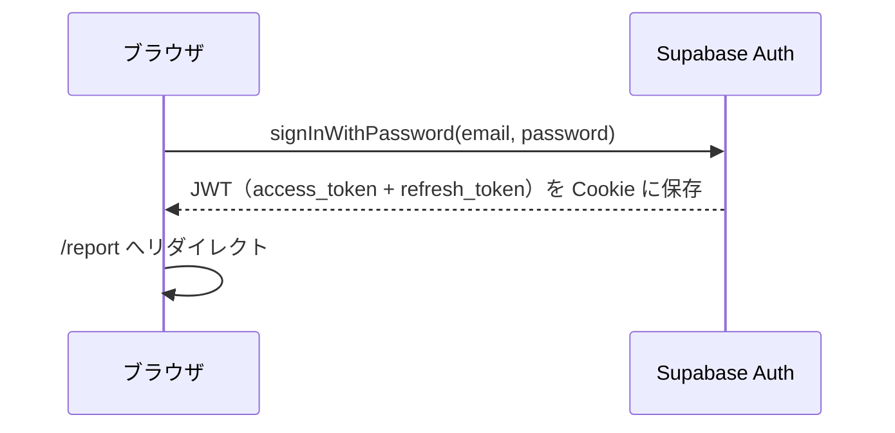
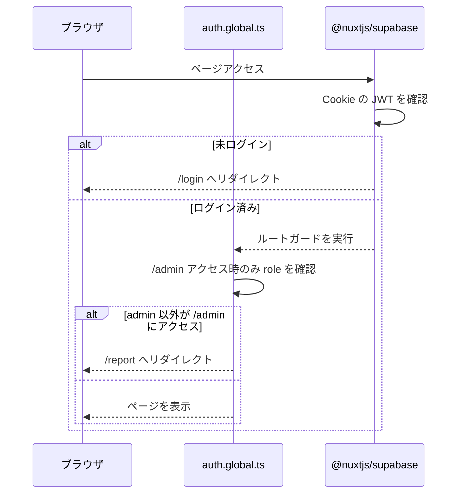
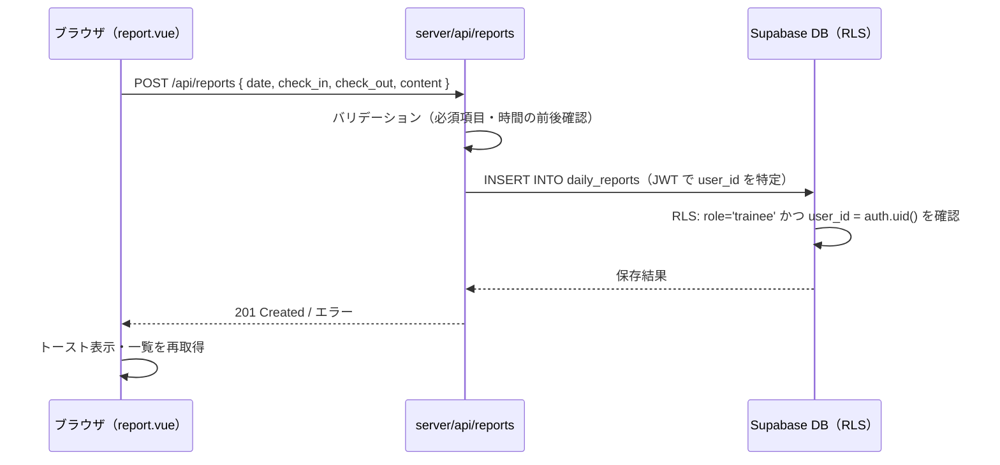
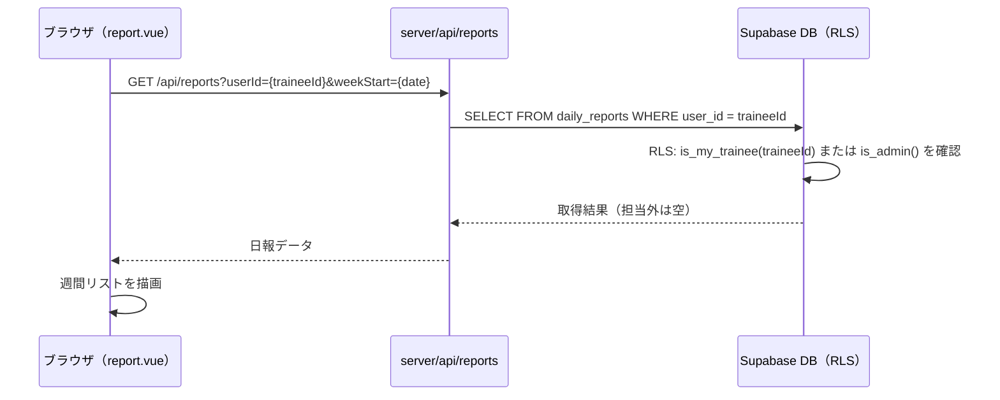
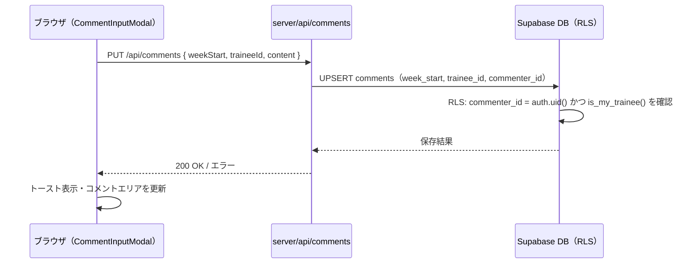

# アーキテクチャ設計書

## システム概要

```
┌─────────────────────────────────────────────────────────────┐
│  ブラウザ（Vue / Nuxt）                                      │
│  pages/ · components/ · composables/                        │
└────────────────────────┬────────────────────────────────────┘
                         │ $fetch('/api/...')
                         ▼
┌─────────────────────────────────────────────────────────────┐
│  Nuxt Server（Nitro / Cloudflare Pages）                    │
│  server/api/                                                │
│  ・リクエストのバリデーション                                │
│  ・serverSupabaseClient でユーザー JWT を引き継ぎ           │
└────────────────────────┬────────────────────────────────────┘
                         │ HTTP (JWT 付き)
                         ▼
┌─────────────────────────────────────────────────────────────┐
│  Supabase                                                   │
│  ┌─────────────┐   ┌──────────────────────────────────┐   │
│  │  Auth       │   │  PostgreSQL + RLS                │   │
│  │  JWT 発行   │   │  profiles / daily_reports        │   │
│  │  セッション  │   │  comments / mentor_assignments   │   │
│  └─────────────┘   └──────────────────────────────────┘   │
└─────────────────────────────────────────────────────────────┘
```

---

## 技術スタック

| レイヤー | 技術 | バージョン | 備考 |
|---------|------|-----------|------|
| フロントエンド | Nuxt 4 + Vue 3 | 4.x | `app/` ディレクトリ構成 |
| UI コンポーネント | Nuxt UI | 3.x | Tailwind CSS ベース |
| ユーティリティ | VueUse | latest | `useLocalStorage` 等 |
| サーバーランタイム | Nitro (Cloudflare Pages) | Nuxt 内蔵 | `server/api/` を実行 |
| 認証 | Supabase Auth + `@nuxtjs/supabase` | latest | JWT ベース |
| データベース | Supabase (PostgreSQL) | latest | RLS で行レベル認可 |
| ホスティング | Cloudflare Pages | - | Nitro `cloudflare-pages` プリセット |
| テスト | Vitest + Vue Test Utils + Playwright | - | Unit / 統合 / E2E |

---

## ディレクトリ構成

```
jornal/
├── app/                          # フロントエンド（Nuxt app ディレクトリ）
│   ├── app.vue                   # ルートコンポーネント
│   ├── assets/css/main.css       # グローバルスタイル
│   ├── components/               # 再利用コンポーネント
│   │   ├── ReportInputModal.vue  # 日報入力・編集モーダル（MS2）
│   │   ├── ReportCard.vue        # 日報カード（インライン展開）（MS3）
│   │   ├── CommentInputModal.vue # 週次コメント入力モーダル（MS3）
│   │   ├── UserAddModal.vue      # ユーザー追加モーダル（MS4）
│   │   └── UserEditModal.vue     # ユーザー編集モーダル（MS4）
│   ├── composables/
│   │   └── useCurrentUser.ts     # ログインユーザーの profile・role を返す
│   ├── layouts/
│   │   └── default.vue           # 全ページ共通ヘッダー・ナビ
│   ├── middleware/
│   │   └── auth.global.ts        # /admin へのロール確認リダイレクト
│   ├── pages/
│   │   ├── index.vue             # / → /report リダイレクト
│   │   ├── login.vue             # ログイン画面
│   │   ├── reset-password.vue    # パスワードリセット
│   │   ├── confirm.vue           # 認証コールバック
│   │   ├── report.vue            # 日報画面（全ロール共通）
│   │   └── admin.vue             # 管理画面（管理者のみ）
│   ├── error.vue                 # 404 / 500 エラー画面
│   └── types/
│       └── database.types.ts     # Supabase から自動生成した型定義
│
├── server/                       # Nuxt Server API（サーバーサイドのみ実行）
│   └── api/
│       ├── reports/
│       │   ├── index.get.ts      # GET  /api/reports      週の日報一覧
│       │   ├── index.post.ts     # POST /api/reports      日報作成
│       │   └── [id]/
│       │       ├── index.put.ts  # PUT  /api/reports/:id  日報更新
│       │       └── index.delete.ts # DELETE /api/reports/:id 日報削除
│       ├── comments/
│       │   ├── index.get.ts      # GET  /api/comments     週次コメント取得
│       │   └── index.put.ts      # PUT  /api/comments     週次コメント保存
│       └── assignments/
│           └── me.get.ts         # GET  /api/assignments/me 担当新人一覧
│
├── supabase/
│   └── migrations/               # DB マイグレーション SQL
│
├── docs/                         # 設計ドキュメント
└── nuxt.config.ts
```

---

## データアクセス層

### 基本方針

フロントエンド（Vue コンポーネント）は **直接 Supabase クライアントを呼ばない**。すべてのデータアクセスは `server/api/` を経由する。

| | フロントエンド | Server API |
|---|---|---|
| 使用するクライアント | `$fetch('/api/...')` | `serverSupabaseClient(event)` |
| Supabase の知識 | 不要 | 必要（PL が担当） |
| テーブル名の露出 | なし | なし（ブラウザから見えない） |
| RLS の適用 | — | 有効（ユーザー JWT で自動適用） |

### Server API の基本構造

```typescript
// server/api/reports/index.get.ts
export default defineEventHandler(async (event) => {
  const client = serverSupabaseClient(event)   // ユーザーの JWT を引き継ぐ
  const query = getQuery(event)                // クエリパラメータ取得

  const { data, error } = await client
    .from('daily_reports')
    .select('*')
    .eq('user_id', /* ユーザーID */)

  if (error) throw createError({ statusCode: 500, message: error.message })
  return data
})
```

### `serverSupabaseClient` と RLS の関係

`serverSupabaseClient(event)` はリクエストに含まれるユーザーの JWT を使って Supabase にアクセスする。そのため **RLS ポリシーはそのまま有効**であり、サーバー側で認可ロジックを二重実装する必要はない。

```
ブラウザ → Cookie（JWT）→ Nuxt Server → serverSupabaseClient（JWT を転送）→ Supabase（RLS 適用）
```

---

## 認証フロー

### ログイン



### ページアクセス時の認証確認

`@nuxtjs/supabase` が全ルートで自動的に JWT の有効性を確認する。未ログインの場合は `/login` へリダイレクト。



---

## 主要データフロー

### 日報入力（新人）



### 日報閲覧（メンター・OJT）



### 週次コメント保存（メンター・OJT）



---

## エラーハンドリング方針

### Server API 側

| 状況 | HTTP ステータス | 対応 |
|------|---------------|------|
| バリデーションエラー | 400 | `createError({ statusCode: 400, message: '...' })` |
| 未認証 | 401 | `@nuxtjs/supabase` が自動処理 |
| RLS によるアクセス拒否 | 403 | Supabase が `error` を返す → 403 に変換 |
| DB エラー | 500 | `error.message` をログ出力、クライアントには汎用メッセージ |

### フロントエンド側

- `$fetch` のエラーは `try/catch` で補足し、トースト通知でユーザーに表示
- フィールド単位のバリデーションエラーはフォーム内に赤文字で表示
- DB エラーなど予期しないエラーは「しばらくしてから再試行してください」と表示

---

## テスト構成

詳細は [PLAN.md のテスト方針](./PLAN.md#テスト方針) を参照。

| レイヤー | ツール | 主なテスト対象 |
|---------|------|-------------|
| Server API ユニットテスト | Vitest | ハンドラーの入出力・バリデーション（Supabase クライアントをモック） |
| Vue コンポーネントテスト | Vitest + Vue Test Utils | UI の表示・操作（`$fetch` をモック） |
| RLS 統合テスト | Vitest | ロール別アクセス制御（実 DB に接続） |
| E2E テスト | Playwright | 日報CRUD・コメント入力などの主要フロー |

---

## デプロイ構成

```
GitHub (main ブランチ)
  │
  ├── GitHub Actions（PR 時）
  │   ├── ESLint
  │   └── 型チェック（tsc）
  │
  └── Cloudflare Pages（main マージ時に自動デプロイ）
      ├── ビルド: pnpm run build
      ├── Nitro preset: cloudflare-pages
      └── 環境変数:
          ├── NUXT_PUBLIC_SUPABASE_URL
          └── NUXT_PUBLIC_SUPABASE_KEY
```

> **注意**: `server/api/` は Cloudflare Pages Functions として実行される。Cloudflare Workers の制約（Node.js API の一部が使用不可）に注意し、`nuxt.config.ts` の `nitro.cloudflare.nodeCompat: true` で互換レイヤーを有効化している。
