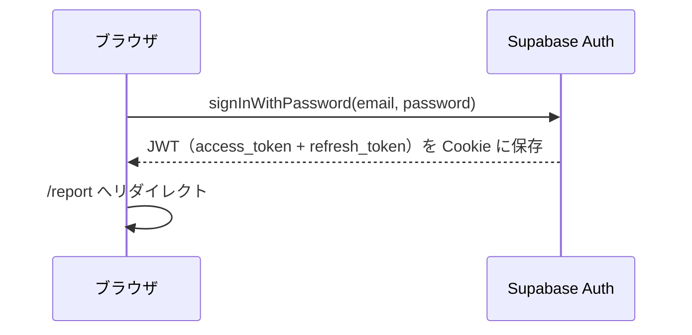
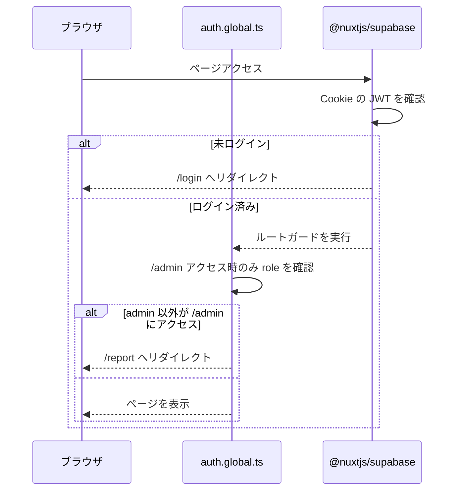
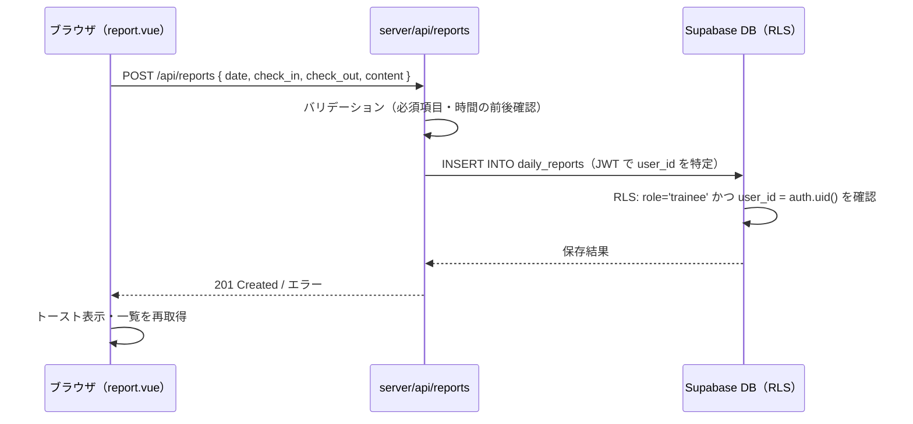
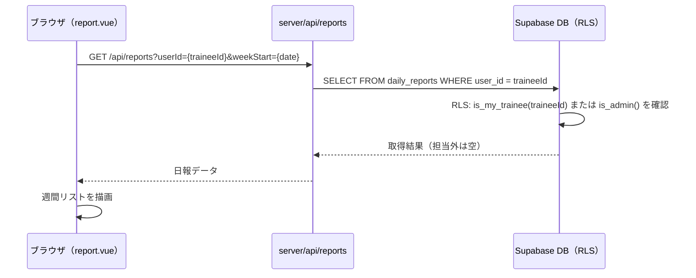
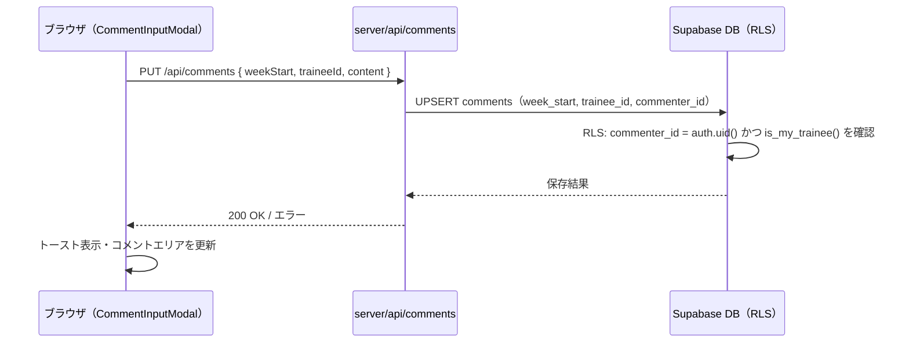

# アーキテクチャ設計書

## システム概要

```
┌─────────────────────────────────────────────────────────────┐
│  ブラウザ（Vue / Nuxt）                                      │
│  pages/ · components/ · composables/                        │
└────────────────────────┬────────────────────────────────────┘
                         │ $fetch('/api/...')
                         ▼
┌─────────────────────────────────────────────────────────────┐
│  Nuxt Server（Nitro / Cloudflare Pages）                    │
│  server/api/                                                │
│  ・リクエストのバリデーション                                │
│  ・serverSupabaseClient でユーザー JWT を引き継ぎ           │
└────────────────────────┬────────────────────────────────────┘
                         │ HTTP (JWT 付き)
                         ▼
┌─────────────────────────────────────────────────────────────┐
│  Supabase                                                   │
│  ┌─────────────┐   ┌──────────────────────────────────┐   │
│  │  Auth       │   │  PostgreSQL + RLS                │   │
│  │  JWT 発行   │   │  profiles / daily_reports        │   │
│  │  セッション  │   │  comments / mentor_assignments   │   │
│  └─────────────┘   └──────────────────────────────────┘   │
└─────────────────────────────────────────────────────────────┘
```

---

## 技術スタック

| レイヤー | 技術 | バージョン | 備考 |
|---------|------|-----------|------|
| フロントエンド | Nuxt 4 + Vue 3 | 4.x | `app/` ディレクトリ構成 |
| UI コンポーネント | Nuxt UI | 4.x | Tailwind CSS ベース・semantic カラートークン |
| チャート | @unovis/vue | 1.x | SVG ベース・mood 推移グラフ（`*.client.vue` でクライアント描画のみ） |
| ユーティリティ | VueUse | latest | `useLocalStorage` 等 |
| サーバーランタイム | Nitro (Cloudflare Pages) | Nuxt 内蔵 | `server/api/` を実行 |
| 認証 | Supabase Auth + `@nuxtjs/supabase` | latest | JWT ベース |
| データベース | Supabase (PostgreSQL) | latest | RLS で行レベル認可 |
| ホスティング | Cloudflare Pages | - | Nitro `cloudflare-pages` プリセット |
| テスト | Vitest + Vue Test Utils + Playwright | - | Unit / 統合 / E2E |

---

## ディレクトリ構成

```
joynal/
├── app/                          # フロントエンド（Nuxt app ディレクトリ）
│   ├── app.vue                   # ルートコンポーネント
│   ├── assets/css/main.css       # グローバルスタイル
│   ├── components/               # ドメイン別フォルダで整理（pathPrefix:false で名前は据え置き）
│   │   ├── admin/                # 管理UI
│   │   │   ├── UserTable.vue     # ユーザー一覧テーブル
│   │   │   ├── UserFormModal.vue # ユーザー招待・編集モーダル（追加/編集兼用）
│   │   │   └── AssignmentRow.vue # メンター/OJT 割り当て1行
│   │   ├── common/               # 共通部品
│   │   │   ├── AppHeader.vue / AppFooter.vue / AuthCard.vue
│   │   │   ├── PasswordChangeModal.vue
│   │   │   └── ConfirmDialog.vue / EmptyState.vue / RoleBadge.vue
│   │   └── report/               # 日報UI
│   │       ├── TraineeSelector.vue   # 担当新人セレクタ（mentor/ojt/admin）
│   │       ├── WeekNavigator.vue / WeekPickerModal.vue  # 週ナビ・週ジャンプ
│   │       ├── ReportRow.vue          # 日報1日分の行（クリックで詳細展開）
│   │       ├── ReportRowDetail.vue    # 展開時の詳細パネル
│   │       ├── ReportInputModal.vue   # 日報入力・編集モーダル（新人）
│   │       ├── CommentArea.vue        # 週次コメント表示
│   │       ├── CommentInputModal.vue  # 週次コメント入力（mentor/ojt）
│   │       ├── MoodStars.vue          # 気分★表示・入力
│   │       ├── WeeklySummary.vue      # 週次サマリーエリア（mentor/ojt/admin・mood推移グラフの器）
│   │       ├── MoodTrendChart.client.vue # mood 推移グラフ（@unovis/vue・クライアント専用）
│   │       ├── CoachHints.vue         # AI コーチングのヒント表示（新人・質問＋短評・代筆なし）
│   │       └── AiSummaryPanel.vue     # AI 週次サマリー表示（生成/再生成・鮮度バッジ・参考情報）
│   ├── composables/
│   │   ├── useCurrentUser.ts        # profile・role を返す（keyed useAsyncData）
│   │   ├── useAssignedTrainees.ts   # 担当新人一覧＋選択状態
│   │   ├── useWeeklyReports.ts      # 週次日報の取得
│   │   ├── useMoodTrend.ts          # mood 推移の取得（直近N週・週次サマリー用）
│   │   ├── useCoach.ts              # AI コーチング取得（POST /api/ai/coach）
│   │   ├── useWeeklySummary.ts      # AI 週次サマリー取得・生成（GET/POST /api/ai/weekly-summary）
│   │   ├── useWeeklyComments.ts     # 週次コメントの取得・振り分け
│   │   ├── useWeekNavigation.ts     # 週の状態管理
│   │   ├── useAdminUsers.ts         # 管理画面のユーザー一覧取得・操作
│   │   ├── useMentorAssignments.ts  # 割り当て編集行のビューモデル生成
│   │   ├── useLazyOpen.ts           # モーダルの遅延マウント・mounted ゲート
│   │   └── useApiError.ts           # $fetch エラーのトースト化
│   ├── utils/                    # app 専用: time / calendarDate / role / fetchError / passwordReset / asyncDataCache
│   ├── layouts/
│   │   └── default.vue           # 全ページ共通ヘッダー・ナビ
│   ├── middleware/
│   │   └── auth.global.ts        # /admin へのロール確認リダイレクト
│   ├── pages/
│   │   ├── index.vue             # / → /report リダイレクト
│   │   ├── login.vue             # ログイン画面
│   │   ├── reset-password.vue    # パスワードリセット（OTPコード送信〜新パスワード設定・1画面）
│   │   ├── confirm.vue           # 認証コールバック
│   │   ├── report.vue            # 日報画面（全ロール共通）
│   │   └── admin.vue             # 管理画面（管理者のみ）
│   └── error.vue                 # 404 / 500 エラー画面
│
├── shared/                       # app・server 共用層（#shared/* でインポート）
│   ├── types/                    # 全型をここに集約
│   │   ├── models.ts             # DB テーブル型エイリアス
│   │   ├── api.ts                # API リクエスト/レスポンス型・共有定数
│   │   ├── schemas.ts            # Zod スキーマ（フォーム＋境界バリデーション）
│   │   ├── database.types.ts     # Supabase 自動生成（編集禁止）
│   │   └── components.ts         # コンポーネント defineExpose 型
│   └── utils/                    # app・server 共通の純粋ロジック（date.ts: 日付/週/曜日）
│
├── server/                       # Nuxt Server API（サーバーサイドのみ実行）
│   ├── api/
│   │   ├── auth/
│   │   │   ├── login.post.ts             # POST /api/auth/login        ログイン
│   │   │   ├── logout.post.ts            # POST /api/auth/logout       ログアウト
│   │   │   ├── reset-password.post.ts    # POST /api/auth/reset-password     OTPコード送信
│   │   │   ├── reset-password-otp.post.ts # POST /api/auth/reset-password-otp コード検証＋新PW設定
│   │   │   └── update-password.post.ts   # POST /api/auth/update-password    ログイン中のPW変更
│   │   ├── reports/
│   │   │   ├── index.get.ts      # GET  /api/reports      週の日報一覧
│   │   │   ├── index.post.ts     # POST /api/reports      日報作成
│   │   │   ├── mood-trend.get.ts # GET  /api/reports/mood-trend 期間の日次 mood 推移
│   │   │   └── [id]/
│   │   │       ├── index.put.ts  # PUT  /api/reports/:id  日報更新
│   │   │       └── index.delete.ts # DELETE /api/reports/:id 日報削除
│   │   ├── ai/
│   │   │   ├── coach.post.ts     # POST /api/ai/coach     新人コーチング（質問＋短評・代筆なし）
│   │   │   ├── weekly-summary.get.ts  # GET  /api/ai/weekly-summary 週次サマリー取得（キャッシュ）
│   │   │   └── weekly-summary.post.ts # POST /api/ai/weekly-summary 週次サマリー生成/再生成
│   │   ├── comments/
│   │   │   ├── index.get.ts      # GET  /api/comments     週次コメント取得
│   │   │   └── index.put.ts      # PUT  /api/comments     週次コメント保存
│   │   ├── assignments/
│   │   │   ├── me.get.ts         # GET  /api/assignments/me 担当新人一覧（管理者は全割り当て情報）
│   │   │   └── index.put.ts      # PUT  /api/assignments  メンター割り当て更新（管理者のみ）
│   │   └── users/
│   │       ├── me.get.ts         # GET  /api/users/me     ログインユーザー自身の profile（email 除く）
│   │       ├── index.get.ts      # GET  /api/users        ユーザー一覧（管理者のみ）
│   │       ├── index.post.ts     # POST /api/users        ユーザー招待（管理者のみ）
│   │       └── [id]/
│   │           └── index.put.ts  # PUT  /api/users/:id    ユーザー更新（管理者のみ）
│   └── utils/                    # server 専用: auth / supabaseError / validate / year / aiChat(プロバイダ非依存 AI アダプタ) / aiCoach(コーチング) / aiWeeklySummary(週次サマリー) / aiRateLimit(日次レート上限)
│
├── supabase/
│   ├── migrations/               # DB マイグレーション SQL
│   ├── config.toml               # Auth 設定（メールテンプレ・OTP・レート制限）
│   └── templates/                # メール本文 HTML（recovery.html）
│
├── docs/                         # 設計ドキュメント
└── nuxt.config.ts
```

---

## データアクセス層

### 基本方針

フロントエンド（Vue コンポーネント）は **直接 Supabase クライアントを呼ばない**。すべてのデータアクセスは `server/api/` を経由する。

| | フロントエンド | Server API |
|---|---|---|
| 使用するクライアント | `$fetch('/api/...')` | `serverSupabaseClient(event)` |
| Supabase の知識 | 不要 | 必要（PL が担当） |
| テーブル名の露出 | なし | なし（ブラウザから見えない） |
| RLS の適用 | — | 有効（ユーザー JWT で自動適用） |

### Server API の基本構造

```typescript
// server/api/reports/index.get.ts
export default defineEventHandler(async (event) => {
  await serverUserId(event)                          // 認証ゲート（未認証は 401）
  const { weekStart, userId } = parseQuery(event, reportsQuerySchema)  // Zod で検証

  const client = await serverSupabaseClient(event)   // ユーザーの JWT を引き継ぐ（await 必須）
  const { data, error } = await client
    .from('daily_reports')
    .select('*')
    .gte('date', weekStart)

  if (error) throw createError({ statusCode: 500, message: 'サーバーエラーが発生しました' })
  return data
})
```

### `serverSupabaseClient` と RLS の関係

`serverSupabaseClient(event)` はリクエストに含まれるユーザーの JWT を使って Supabase にアクセスする。そのため **RLS ポリシーはそのまま有効**であり、サーバー側で認可ロジックを二重実装する必要はない。

```
ブラウザ → Cookie（JWT）→ Nuxt Server → serverSupabaseClient（JWT を転送）→ Supabase（RLS 適用）
```

> **例外（service role 経由のエンドポイント）**: ユーザー管理系（`/api/users` 系）や `assignments` PUT は `serverSupabaseServiceRole` で **RLS を迂回**するため、`assertAdminRole`（`server/utils/auth.ts`）でサーバー側にも明示的な admin ゲートを置く（RLS の `is_admin()` と二重防御）。「二重実装しない」が当てはまるのは JWT＝`serverSupabaseClient` 経由で RLS が効くエンドポイント。

---

## 認証フロー

### ログイン



### ページアクセス時の認証確認

`@nuxtjs/supabase` が全ルートで自動的に JWT の有効性を確認する。未ログインの場合は `/login` へリダイレクト。



---

## 主要データフロー

### 日報入力（新人）



### 日報閲覧（メンター・OJT）



### 週次コメント保存（メンター・OJT）



---

## エラーハンドリング方針

### Server API 側

| 状況 | HTTP ステータス | 対応 |
|------|---------------|------|
| バリデーションエラー | 400 | `createError({ statusCode: 400, message: '...' })` |
| 未認証 | 401 | `@nuxtjs/supabase` が自動処理 |
| RLS によるアクセス拒否 | 403 | Supabase が `error` を返す → 403 に変換 |
| DB エラー | 500 | `error.message` をログ出力、クライアントには汎用メッセージ |

### フロントエンド側

- `$fetch` のエラーは `try/catch` で補足し、トースト通知でユーザーに表示
- フィールド単位のバリデーションエラーはフォーム内に赤文字で表示
- DB エラーなど予期しないエラーは「しばらくしてから再試行してください」と表示

---

## テスト構成

詳細は [PLAN.md のテスト方針](./PLAN.md#テスト方針) を参照。

| レイヤー | ツール | 主なテスト対象 |
|---------|------|-------------|
| Server API ユニットテスト | Vitest | ハンドラーの入出力・バリデーション（Supabase クライアントをモック） |
| Vue コンポーネントテスト | Vitest + Vue Test Utils | UI の表示・操作（`$fetch` をモック） |
| RLS 統合テスト | Vitest | ロール別アクセス制御（実 DB に接続） |
| E2E テスト | Playwright（ローカル Supabase） | ログイン認証・日報CRUD・週次コメント入力などの主要フロー |

---

## デプロイ構成

```
GitHub (main ブランチ)
  │
  ├── GitHub Actions（PR 時 / .github/workflows/ci.yml）
  │   ├── lint-and-typecheck: ESLint ＋ vue-tsc
  │   ├── test: Vitest（ユニット・統合）
  │   ├── build: pnpm build（Cloudflare プリセット）
  │   └── security: pnpm audit --audit-level=high
  │
  │   ※ E2E（Playwright）は CI では実行せずローカル実行のみ
  │
  └── Cloudflare Pages（main マージ時に自動デプロイ）
      ├── ビルド: pnpm run build
      ├── Nitro preset: cloudflare-pages
      └── 環境変数:
          ├── NUXT_PUBLIC_SUPABASE_URL    # Supabase プロジェクト URL
          ├── NUXT_PUBLIC_SUPABASE_KEY    # anon（publishable）key
          ├── NUXT_SUPABASE_SECRET_KEY    # service_role（secret）key。ユーザー管理・招待・無効化で
          │                               # service role 経由のアクセスに使う（@nuxtjs/supabase v2 はこの名前で読む）
          ├── NUXT_ANTHROPIC_API_KEY      # AI（Claude）。コーチング・週次サマリーで使用
          ├── NUXT_OPENAI_API_KEY         # AI（OpenAI）。プロバイダ切替時に使用
          ├── NUXT_GEMINI_API_KEY         # AI（Google Gemini）。OpenAI 互換エンドポイント経由
          └── NUXT_AI_PROVIDER / NUXT_*_MODEL / NUXT_AI_MAX_TOKENS / NUXT_AI_DAILY_LIMIT  # AI 既定（provider/model/トークン上限/日次レート上限）
```

> 環境変数は Cloudflare Pages の **Production / Preview スコープごとに別管理**。ブランチデプロイは Preview スコープを参照し、追加後は再デプロイが必要。`NUXT_SUPABASE_SECRET_KEY` 未設定だとユーザー管理系 API（`/api/users` など）が 500 になる。

> **注意**: `server/api/` は Cloudflare Pages Functions として実行される。Cloudflare Workers の制約（Node.js API の一部が使用不可）に注意し、`nuxt.config.ts` の `nitro.cloudflare.nodeCompat: true` で互換レイヤーを有効化している。外部 AI プロバイダ（Claude / OpenAI / Gemini）への送信は SDK を使わず素の `$fetch` で行う（Workers 互換のため。Gemini は OpenAI 互換エンドポイントを使用）。
