# コンポーネント構成図

> 実線: 現在実装済み / 点線: 今後実装予定

```mermaid
graph TD
  subgraph Entry["エントリーポイント"]
    AppVue["app.vue"]
  end

  subgraph Middleware["ミドルウェア"]
    AuthMiddleware["auth.global.ts\n/admin へのアクセス時に\nadmin ロールを確認"]
  end

  subgraph Layout["レイアウト"]
    DefaultLayout["layouts/default.vue\nヘッダー・ナビゲーション\nログアウトボタン"]
  end

  subgraph Pages["ページ"]
    IndexPage["/index.vue\n→ /report へリダイレクト"]
    LoginPage["login.vue\n/login\nメール・パスワード認証"]
    ResetPage["reset-password.vue\n/reset-password\nパスワードリセットメール送信"]
    ConfirmPage["confirm.vue\n/confirm\n認証コールバック"]
    ReportPage["report.vue\n/report\n週次日報一覧\nロール別表示切り替え"]
    AdminPage["admin.vue\n/admin\nユーザー管理\nメンター割り当て"]
    ErrorPage["error.vue\n404 / 500"]
  end

  subgraph Components["コンポーネント（今後追加）"]
    ReportInputModal["ReportInputModal.vue\n日報入力・編集モーダル\n新人のみ操作可"]
    ReportCard["ReportCard.vue\n日報カード（インライン展開）\nクリックで詳細表示"]
    CommentInputModal["CommentInputModal.vue\n週次コメント入力モーダル\nメンター・OJT用"]
    UserAddModal["UserAddModal.vue\nユーザー追加モーダル\n管理者用"]
    UserEditModal["UserEditModal.vue\nユーザー編集モーダル\n管理者用"]
  end

  subgraph Composables["Composables"]
    UseCurrentUser["useCurrentUser.ts\nprofile / role\nisAdmin / isMentor\nisOjt / isTrainee"]
  end

  subgraph Types["型定義 (app/types/)"]
    DBTypes["database.types.ts\nSupabase 自動生成（編集禁止）"]
    Models["models.ts\nDailyReport / Comment\nProfile / などのエイリアス"]
    ApiTypes["api.ts\nReportCreateBody\nCommentUpsertBody など"]
    Schemas["schemas.ts\nreportSchema\ncommentSchema（Zod）"]
  end

  subgraph ServerAPI["Server API (server/api/)"]
    ReportsAPI["reports/\nGET 週次日報一覧\nPOST 日報作成\nPUT 日報更新\nDELETE 日報削除"]
    CommentsAPI["comments/\nGET 週次コメント取得\nPUT 週次コメント保存"]
    AssignmentsAPI["assignments/\nGET /me 担当新人一覧\nPUT メンター割り当て更新"]
    UsersAPI["users/\nGET ユーザー一覧\nPOST ユーザー招待\nPUT ユーザー更新"]
  end

  subgraph Supabase["Supabase（外部サービス）"]
    SupabaseAuth["Supabase Auth\n認証・セッション管理"]
    SupabaseDB["Supabase DB + RLS\nprofiles\ndaily_reports\ncomments\nmentor_assignments"]
  end

  AppVue --> DefaultLayout
  DefaultLayout --> Pages
  AuthMiddleware -. "/admin アクセス時" .-> AdminPage

  DefaultLayout --> UseCurrentUser
  ReportPage --> UseCurrentUser
  AdminPage --> UseCurrentUser
  UseCurrentUser --> SupabaseAuth

  LoginPage --> SupabaseAuth
  ResetPage --> SupabaseAuth
  ConfirmPage --> SupabaseAuth

  ReportPage --"$fetch"--> ReportsAPI
  ReportPage --"$fetch"--> CommentsAPI
  ReportPage --"$fetch"--> AssignmentsAPI
  AdminPage --"$fetch"--> ReportsAPI
  AdminPage --"$fetch"--> AssignmentsAPI
  AdminPage --"$fetch"--> UsersAPI

  ReportsAPI --> SupabaseDB
  CommentsAPI --> SupabaseDB
  AssignmentsAPI --> SupabaseDB
  UsersAPI --> SupabaseDB

  ReportPage -. "MS2" .-> ReportInputModal
  ReportPage -. "MS3" .-> ReportCard
  ReportPage -. "MS3" .-> CommentInputModal
  AdminPage -. "MS4" .-> UserAddModal
  AdminPage -. "MS4" .-> UserEditModal

  UseCurrentUser --> DBTypes
  ReportPage --> Models
  ReportPage --> Schemas
  AdminPage --> Models
  ReportsAPI --> Models
  ReportsAPI --> ApiTypes
  CommentsAPI --> ApiTypes
  Models --> DBTypes
```

---

## 各ファイルの役割

### エントリーポイント

| ファイル | 役割 |
|---------|------|
| `app.vue` | Nuxt アプリのルート。`NuxtLayout` と `NuxtPage` を配置するだけ |

### ミドルウェア

| ファイル | 役割 |
|---------|------|
| `middleware/auth.global.ts` | 全ルートで実行。`/admin` へのアクセス時のみ `profiles.role` を確認し、admin 以外は `/report` へリダイレクト。未ログインのリダイレクトは `@nuxtjs/supabase` が自動処理 |

### レイアウト

| ファイル | 役割 |
|---------|------|
| `layouts/default.vue` | 全ページ共通のヘッダー・ナビ。`useCurrentUser` でロールを取得し、管理者のみ管理画面リンクを表示 |

### ページ

| ファイル | パス | 役割 |
|---------|------|------|
| `pages/index.vue` | `/` | `/report` へリダイレクトするだけ |
| `pages/login.vue` | `/login` | メール・パスワードでログイン |
| `pages/reset-password.vue` | `/reset-password` | パスワードリセットメール送信 |
| `pages/confirm.vue` | `/confirm` | メールリンクからの認証コールバック（`@nuxtjs/supabase` が自動処理） |
| `pages/report.vue` | `/report` | 週次日報一覧。ロールに応じて表示・操作内容が切り替わる共通画面 |
| `pages/admin.vue` | `/admin` | ユーザー管理・メンター割り当てのタブ切り替え画面 |
| `error.vue` | （自動） | 404 / 500 エラー画面 |

### Composables

| ファイル | 役割 |
|---------|------|
| `composables/useCurrentUser.ts` | ログインユーザーの `profiles` レコードを取得。`role` / `isAdmin` / `isMentor` / `isOjt` / `isTrainee` をリアクティブに返す。複数ページで共通利用 |

### 型定義 (`app/types/`)

| ファイル | 役割 |
|---------|------|
| `types/database.types.ts` | Supabase から自動生成。**編集禁止**（`pnpm supabase:types` で再生成） |
| `types/models.ts` | DB テーブル型のエイリアス（`DailyReport` / `Comment` / `Profile` など）|
| `types/api.ts` | Server API のリクエスト・レスポンス型 |
| `types/schemas.ts` | Zod スキーマ（フォームバリデーション用）と導出した型 |

### Server API (`server/api/`)

| ファイル | エンドポイント | 役割 |
|---------|-------------|------|
| `reports/index.get.ts` | `GET /api/reports` | 週の日報一覧取得 |
| `reports/index.post.ts` | `POST /api/reports` | 日報作成 |
| `reports/[id]/index.put.ts` | `PUT /api/reports/:id` | 日報更新 |
| `reports/[id]/index.delete.ts` | `DELETE /api/reports/:id` | 日報削除 |
| `comments/index.get.ts` | `GET /api/comments` | 週次コメント取得 |
| `comments/index.put.ts` | `PUT /api/comments` | 週次コメント保存（upsert） |
| `assignments/me.get.ts` | `GET /api/assignments/me` | 担当新人一覧取得（管理者は全割り当て情報） |
| `assignments/index.put.ts` | `PUT /api/assignments` | メンター割り当て更新（管理者のみ） |
| `users/index.get.ts` | `GET /api/users` | ユーザー一覧取得（管理者のみ） |
| `users/index.post.ts` | `POST /api/users` | ユーザー招待（管理者のみ） |
| `users/[id]/index.put.ts` | `PUT /api/users/:id` | ユーザー更新（管理者のみ） |

### 今後追加するコンポーネント

| ファイル | MS | 役割 |
|---------|-----|------|
| `components/ReportInputModal.vue` | MS2 | 日報の入力・編集モーダル（新人のみ） |
| `components/ReportCard.vue` | MS3 | 日報カード。クリックでインライン展開し、詳細内容を表示 |
| `components/CommentInputModal.vue` | MS3 | 週次コメント入力モーダル（メンター・OJTのみ） |
| `components/UserAddModal.vue` | MS4 | ユーザー招待フォームモーダル（管理者のみ） |
| `components/UserEditModal.vue` | MS4 | ユーザー編集モーダル（名前・メール・役割の変更、管理者のみ） |
