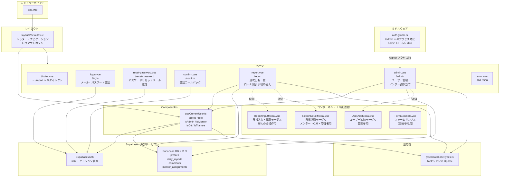

# コンポーネント構成図

> 実線: 現在実装済み / 点線: 今後実装予定

---

## 各ファイルの役割

### エントリーポイント

| ファイル | 役割 |
|---------|------|
| `app.vue` | Nuxt アプリのルート。`NuxtLayout` と `NuxtPage` を配置するだけ |

### ミドルウェア

| ファイル | 役割 |
|---------|------|
| `middleware/auth.global.ts` | 全ルートで実行。`/admin` へのアクセス時のみ `profiles.role` を確認し、admin 以外は `/report` へリダイレクト。未ログインのリダイレクトは `@nuxtjs/supabase` が自動処理 |

### レイアウト

| ファイル | 役割 |
|---------|------|
| `layouts/default.vue` | 全ページ共通のヘッダー・ナビ。`useCurrentUser` でロールを取得し、管理者のみ管理画面リンクを表示 |

### ページ

| ファイル | パス | 役割 |
|---------|------|------|
| `pages/index.vue` | `/` | `/report` へリダイレクトするだけ |
| `pages/login.vue` | `/login` | メール・パスワードでログイン |
| `pages/reset-password.vue` | `/reset-password` | パスワードリセットメール送信 |
| `pages/confirm.vue` | `/confirm` | メールリンクからの認証コールバック（`@nuxtjs/supabase` が自動処理） |
| `pages/report.vue` | `/report` | 週次日報一覧。ロールに応じて表示・操作内容が切り替わる共通画面 |
| `pages/admin.vue` | `/admin` | ユーザー管理・メンター割り当てのタブ切り替え画面 |
| `error.vue` | （自動） | 404 / 500 エラー画面 |

### Composables

| ファイル | 役割 |
|---------|------|
| `composables/useCurrentUser.ts` | ログインユーザーの `profiles` レコードを取得。`role` / `isAdmin` / `isMentor` / `isOjt` / `isTrainee` をリアクティブに返す。複数ページで共通利用 |

### 今後追加するコンポーネント

| ファイル | MS | 役割 |
|---------|-----|------|
| `components/ReportInputModal.vue` | MS2 | 日報の入力・編集モーダル（新人のみ） |
| `components/ReportDetailModal.vue` | MS3 | 日報の詳細表示モーダル（メンター・OJT・管理者） |
| `components/UserAddModal.vue` | MS4 | ユーザー招待フォームモーダル（管理者のみ） |
