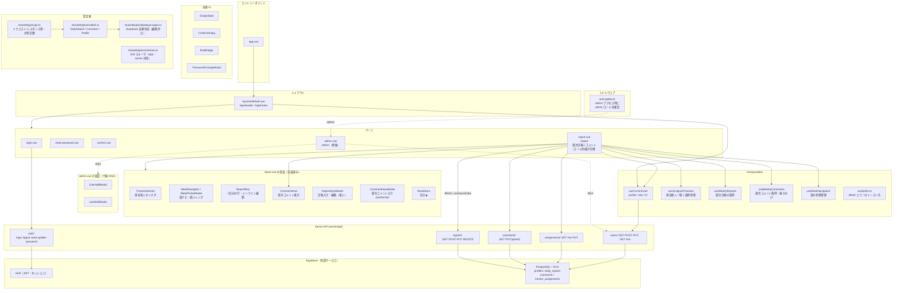

# コンポーネント構成図

> **進捗**: MS2（日報入力）・MS3（メンターコメント）まで実装済み。MS4（管理者機能）は `admin.vue` の骨格と一部 API のみ。
> 実線: 実装済み / 点線: 今後（MS4）。

---

## 各ファイルの役割

### ページ（`app/pages/`）

| ファイル | パス | 役割 |
|---------|------|------|
| `index.vue` | `/` | `/report` へリダイレクト |
| `login.vue` | `/login` | メール・パスワードでログイン |
| `reset-password.vue` | `/reset-password` | パスワードリセットメール送信 |
| `confirm.vue` | `/confirm` | メールリンクからの認証コールバック |
| `report.vue` | `/report` | 週次日報＋週次コメント。ロールで表示・操作が切り替わる共通画面 |
| `admin.vue` | `/admin` | ユーザー管理・メンター割り当て（MS4 で中身を実装） |
| `error.vue` | （自動） | 404 / 500 エラー画面 |

### コンポーネント（`app/components/`、実装済み）

| ファイル | 役割 | 主な利用元 |
|---------|------|-----------|
| `AppHeader.vue` / `AppFooter.vue` | 共通ヘッダー（ユーザーメニュー・ログアウト）／フッター | `layouts/default.vue` |
| `AuthCard.vue` | ログイン等のカード枠 | `login` / `reset-password` |
| `PasswordChangeModal.vue` | パスワード変更モーダル | `AppHeader` |
| `TraineeSelector.vue` | 担当新人セレクタ（表示専用・`USelectMenu`） | `report.vue`（非 trainee） |
| `WeekNavigator.vue` / `WeekPickerModal.vue` | 週ナビ（前後）／週ジャンプ（日付ピッカー） | `report.vue` |
| `ReportRow.vue` | 日報1日分の行。報告があればクリックでインライン展開（全ロール）。新人はペンで入力/編集 | `report.vue` |
| `MoodStars.vue` | 気分の★表示・入力 | `ReportRow` / `ReportInputModal` |
| `ReportInputModal.vue` | 日報の入力・編集モーダル（新人のみ） | `report.vue` |
| `CommentArea.vue` | 週次コメント表示（mentor/ojt 2カラム）。自ロールのときだけ入力/編集ボタン | `report.vue` |
| `CommentInputModal.vue` | 週次コメント入力・編集モーダル（mentor/ojt） | `report.vue` |
| `EmptyState.vue` | 空状態プレースホルダ（絵文字/アイコン＋メッセージ＋slot） | `report.vue` ほか |
| `ConfirmDialog.vue` | 破壊的操作の確認ダイアログ | 削除確認など |
| `RoleBadge.vue` | ロールバッジ | `CommentArea` ほか |

> 旧設計の `ReportCard.vue` は、テーブル行を直接インライン展開する `ReportRow.vue` + 週次コメントの `CommentArea.vue` に置き換わった。

### Composables（`app/composables/`）

| ファイル | 役割 |
|---------|------|
| `useCurrentUser.ts` | ログインユーザーの `profiles` を取得（keyed `useAsyncData('current-user')`）。`role` / `isAdmin` / `isMentor` / `isOjt` / `isTrainee` を返す |
| `useAssignedTrainees.ts` | 非 trainee 向けに担当新人一覧（`GET /api/assignments/me`）を取得。`traineeOptions` と書き込み可能 computed の `selectedTraineeId`（mentor/ojt は先頭既定選択、admin は未選択） |
| `useWeeklyReports.ts` | 指定週・対象ユーザーの日報を取得（keyed `useAsyncData('reports-week', { server: false })`）。`reportByDate` 索引も提供 |
| `useWeeklyComments.ts` | 指定週・対象新人の週次コメントを取得し `commenter.role` で mentor/ojt に振り分け |
| `useWeekNavigation.ts` | 「今週月曜」計算と前後/任意週ジャンプの状態管理 |
| `useApiError.ts` | `$fetch` エラーを statusCode/code 別メッセージでトースト通知 |

> ユーティリティ関数は `app/utils/`（`date.ts` / `time.ts` / `calendarDate.ts` / `role.ts` / `fetchError.ts`）。

### 型定義

> 型は **すべて `shared/types/`** に集約し、`#shared/types/*` でインポートする（app・server 共用）。

| ファイル | 役割 |
|---------|------|
| `models.ts` | DB テーブル型のエイリアス（`DailyReport` / `Comment` / `Profile` ほか） |
| `api.ts` | API リクエスト・レスポンス型と共有定数（`UserRole` / `MOOD_VALUES` / `CommentWithCommenter` ほか） |
| `schemas.ts` | Zod スキーマ（フォーム＋サーバー境界の query/body）と導出型 |
| `database.types.ts` | Supabase 自動生成（**編集禁止**）。`nuxt.config` の `supabase.types` も `#shared/types/database.types.ts` を指す |
| `components.ts` | コンポーネントの defineExpose 型 |

### Server API（`server/api/`）

| ファイル | エンドポイント | 役割 |
|---------|-------------|------|
| `reports/index.get.ts` | `GET /api/reports` | 週の日報一覧（`userId` 指定で対象新人を絞り込み） |
| `reports/index.post.ts` | `POST /api/reports` | 日報作成 |
| `reports/[id]/index.put.ts` | `PUT /api/reports/:id` | 日報更新 |
| `reports/[id]/index.delete.ts` | `DELETE /api/reports/:id` | 日報削除 |
| `comments/index.get.ts` | `GET /api/comments` | 週次コメント取得（weekStart + traineeId） |
| `comments/index.put.ts` | `PUT /api/comments` | 週次コメント保存（upsert・commenter は JWT から付与） |
| `assignments/me.get.ts` | `GET /api/assignments/me` | 担当新人一覧（admin は全割り当て情報） |
| `assignments/index.put.ts` | `PUT /api/assignments` | メンター割り当て更新（管理者のみ） |
| `users/index.get.ts` / `index.post.ts` / `[id]/index.put.ts` | `GET/POST/PUT /api/users(/:id)` | ユーザー一覧・招待・更新（管理者のみ） |
| `users/me.get.ts` | `GET /api/users/me` | ログインユーザーの profile（email を除く） |
| `auth/*.post.ts` | `POST /api/auth/*` | login / logout / reset-password / update-password |

### 今後追加するコンポーネント（MS4）

| ファイル | 役割 |
|---------|------|
| `components/UserAddModal.vue` | ユーザー招待フォームモーダル（管理者のみ） |
| `components/UserEditModal.vue` | ユーザー編集モーダル（名前・メール・役割、管理者のみ） |
