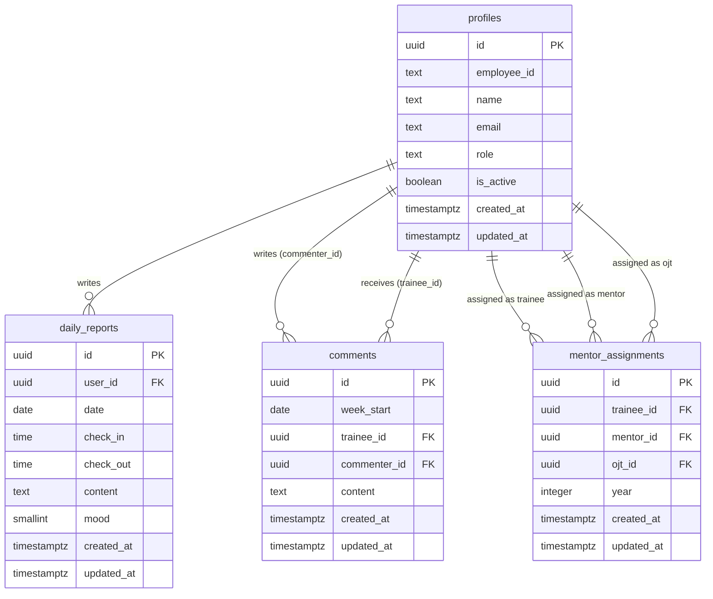

# DBテーブル設計書

## 基本方針

- Supabaseの`auth.users`（認証）と`public.profiles`（アプリ情報）を分離する
- 全テーブルに`created_at`・`updated_at`を設け、`updated_at`はトリガーで自動更新する
- IDはすべて`uuid`とし、`gen_random_uuid()`でデフォルト生成する
- RLSポリシーは別ドキュメント（[rls-design.md](./rls-design.md)）に記載する

---

## ER図



---

## テーブル定義

---

### `profiles`

Supabaseの`auth.users`と1対1で対応するアプリ固有のユーザー情報テーブル。

| カラム | 型 | 制約 | 説明 |
|--------|-----|------|------|
| `id` | `uuid` | PK, REFERENCES auth.users(id) ON DELETE CASCADE | auth.usersのIDと同一 |
| `employee_id` | `text` | NOT NULL, UNIQUE | 社員ID |
| `name` | `text` | NOT NULL | 表示名 |
| `email` | `text` | NOT NULL | メールアドレス（auth.usersと同期）。`authenticated` からは列権限で SELECT 除外（PII 保護・migration `20260529_01`、詳細は rls-design.md） |
| `role` | `text` | NOT NULL, CHECK (role IN ('trainee','mentor','ojt','admin')) | ユーザー種別 |
| `is_active` | `boolean` | NOT NULL, DEFAULT true | 無効化フラグ（falseでログイン不可） |
| `created_at` | `timestamptz` | NOT NULL, DEFAULT now() | 作成日時 |
| `updated_at` | `timestamptz` | NOT NULL, DEFAULT now() | 更新日時（トリガーで自動更新） |

```sql
CREATE TABLE public.profiles (
  id          uuid        PRIMARY KEY REFERENCES auth.users(id) ON DELETE CASCADE,
  employee_id text        NOT NULL UNIQUE,
  name        text        NOT NULL,
  email       text        NOT NULL,
  role        text        NOT NULL CHECK (role IN ('trainee', 'mentor', 'ojt', 'admin')),
  is_active   boolean     NOT NULL DEFAULT true,
  created_at  timestamptz NOT NULL DEFAULT now(),
  updated_at  timestamptz NOT NULL DEFAULT now()
);
```

---

### `daily_reports`

新人が入力する日報テーブル。同一ユーザーの同一日付は1件のみ登録可能。

| カラム | 型 | 制約 | 説明 |
|--------|-----|------|------|
| `id` | `uuid` | PK, DEFAULT gen_random_uuid() | |
| `user_id` | `uuid` | NOT NULL, REFERENCES profiles(id) ON DELETE CASCADE | 日報を書いた新人 |
| `date` | `date` | NOT NULL | 日報の日付（土日・祝日は入力しない運用） |
| `check_in` | `time` | NOT NULL | 出勤時間 |
| `check_out` | `time` | NOT NULL | 退勤時間 |
| `content` | `text` | NOT NULL | やったこと（長文可） |
| `mood` | `smallint` | NULL, CHECK (mood BETWEEN 1 AND 5) | 気分（1〜5、任意）。未入力の場合は NULL で保存する |
| `created_at` | `timestamptz` | NOT NULL, DEFAULT now() | |
| `updated_at` | `timestamptz` | NOT NULL, DEFAULT now() | |

**制約**:
- `UNIQUE(user_id, date)` — 同一ユーザーの同一日付は1件のみ
- `CHECK(check_out > check_in)` — 退勤時間 > 出勤時間

```sql
CREATE TABLE public.daily_reports (
  id         uuid        PRIMARY KEY DEFAULT gen_random_uuid(),
  user_id    uuid        NOT NULL REFERENCES public.profiles(id) ON DELETE CASCADE,
  date       date        NOT NULL,
  check_in   time        NOT NULL,
  check_out  time        NOT NULL CHECK (check_out > check_in),
  content    text        NOT NULL,
  mood       smallint    CHECK (mood BETWEEN 1 AND 5),
  created_at timestamptz NOT NULL DEFAULT now(),
  updated_at timestamptz NOT NULL DEFAULT now(),
  UNIQUE (user_id, date)
);
```

---

### `comments`

メンター・OJTが新人に対して入力する週次コメントテーブル。1週1人1コメントの上書き仕様。

| カラム | 型 | 制約 | 説明 |
|--------|-----|------|------|
| `id` | `uuid` | PK, DEFAULT gen_random_uuid() | |
| `week_start` | `date` | NOT NULL | 対象週の月曜日の日付（例: 2026-04-20） |
| `trainee_id` | `uuid` | NOT NULL, REFERENCES profiles(id) ON DELETE CASCADE | コメント対象の新人 |
| `commenter_id` | `uuid` | NOT NULL, REFERENCES profiles(id) ON DELETE CASCADE | コメントを書いたメンターまたはOJT |
| `content` | `text` | NOT NULL | コメント本文（長文可） |
| `created_at` | `timestamptz` | NOT NULL, DEFAULT now() | |
| `updated_at` | `timestamptz` | NOT NULL, DEFAULT now() | |

**制約**:
- `UNIQUE(week_start, trainee_id, commenter_id)` — 同一週・同一コンビは1件のみ（上書き時はUPDATE）

```sql
CREATE TABLE public.comments (
  id           uuid        PRIMARY KEY DEFAULT gen_random_uuid(),
  week_start   date        NOT NULL,
  trainee_id   uuid        NOT NULL REFERENCES public.profiles(id) ON DELETE CASCADE,
  commenter_id uuid        NOT NULL REFERENCES public.profiles(id) ON DELETE CASCADE,
  content      text        NOT NULL,
  created_at   timestamptz NOT NULL DEFAULT now(),
  updated_at   timestamptz NOT NULL DEFAULT now(),
  UNIQUE (week_start, trainee_id, commenter_id)
);
```

---

### `mentor_assignments`

新人とメンター・OJTの割り当てテーブル。年度ごとに管理し、途中変更も考慮して履歴を持つ。

| カラム | 型 | 制約 | 説明 |
|--------|-----|------|------|
| `id` | `uuid` | PK, DEFAULT gen_random_uuid() | |
| `trainee_id` | `uuid` | NOT NULL, REFERENCES profiles(id) ON DELETE CASCADE | 新人 |
| `mentor_id` | `uuid` | REFERENCES profiles(id) ON DELETE SET NULL | メンター（未割り当ての場合NULL） |
| `ojt_id` | `uuid` | REFERENCES profiles(id) ON DELETE SET NULL | OJT（未割り当ての場合NULL） |
| `year` | `integer` | NOT NULL | 年度（例: 2026） |
| `created_at` | `timestamptz` | NOT NULL, DEFAULT now() | |
| `updated_at` | `timestamptz` | NOT NULL, DEFAULT now() | |

**制約**:
- `UNIQUE(trainee_id, year)` — 同一新人の同一年度は1件のみ

> **注意**: メンター・OJTが途中で変更された場合もこのレコードをUPDATEする（履歴は`updated_at`で把握）。変更後のメンター・OJTは過去の日報も閲覧可能とする（RLS設計参照）。

```sql
CREATE TABLE public.mentor_assignments (
  id         uuid        PRIMARY KEY DEFAULT gen_random_uuid(),
  trainee_id uuid        NOT NULL REFERENCES public.profiles(id) ON DELETE CASCADE,
  mentor_id  uuid        REFERENCES public.profiles(id) ON DELETE SET NULL,
  ojt_id     uuid        REFERENCES public.profiles(id) ON DELETE SET NULL,
  year       integer     NOT NULL,
  created_at timestamptz NOT NULL DEFAULT now(),
  updated_at timestamptz NOT NULL DEFAULT now(),
  UNIQUE (trainee_id, year)
);
```

---

## 共通トリガー（`updated_at`自動更新）

全テーブルに適用する。

```sql
CREATE OR REPLACE FUNCTION public.handle_updated_at()
RETURNS trigger AS $$
BEGIN
  NEW.updated_at = now();
  RETURN NEW;
END;
$$ LANGUAGE plpgsql;

CREATE TRIGGER set_updated_at
  BEFORE UPDATE ON public.profiles
  FOR EACH ROW EXECUTE FUNCTION public.handle_updated_at();

CREATE TRIGGER set_updated_at
  BEFORE UPDATE ON public.daily_reports
  FOR EACH ROW EXECUTE FUNCTION public.handle_updated_at();

CREATE TRIGGER set_updated_at
  BEFORE UPDATE ON public.comments
  FOR EACH ROW EXECUTE FUNCTION public.handle_updated_at();

CREATE TRIGGER set_updated_at
  BEFORE UPDATE ON public.mentor_assignments
  FOR EACH ROW EXECUTE FUNCTION public.handle_updated_at();
```

---

## インデックス

パフォーマンスを考慮して追加するインデックス。

```sql
-- 新人ごとの日報を日付で取得するケースが多い
CREATE INDEX idx_daily_reports_user_date ON public.daily_reports (user_id, date DESC);

-- 週単位でコメントを取得するケースが多い
CREATE INDEX idx_comments_week_trainee ON public.comments (week_start, trainee_id);

-- 年度・新人でアサインを取得するケースが多い
CREATE INDEX idx_mentor_assignments_year_trainee ON public.mentor_assignments (year, trainee_id);
```
