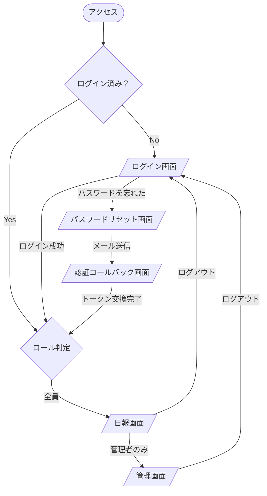

# 画面一覧・画面遷移図

## 画面一覧

| # | 画面名 | パス | 対象ユーザー |
|---|--------|------|-------------|
| 1 | ログイン画面 | `/login` | 全員 |
| 2 | パスワードリセット画面 | `/reset-password` | 全員 |
| 3 | 認証コールバック画面 | `/confirm` | 全員（メールリンクからの遷移） |
| 4 | 日報画面 | `/report` | 全員（ログイン後） |
| 5 | 管理画面 | `/admin` | 管理者 |
| - | エラー画面 | （自動） | 全員（404/500時） |

---

## ロール別アクセス可能画面

| 画面 | 新人 | メンター | OJT | 管理者 |
|------|:----:|:--------:|:---:|:------:|
| ログイン画面 | ○ | ○ | ○ | ○ |
| パスワードリセット画面 | ○ | ○ | ○ | ○ |
| 認証コールバック画面 | ○ | ○ | ○ | ○ |
| 日報画面 | ○ | ○ | ○ | ○ |
| 管理画面 | × | × | × | ○ |

> 未ログイン状態でアクセスした場合は、すべてのページからログイン画面へリダイレクトする。
> ログイン後は全員 `/report`（日報画面）へ遷移する。管理者のみナビに管理画面リンクが表示される。

---

## 画面遷移図

---

## 各画面の主要コンポーネント

### 1. ログイン画面 `/login`
- メールアドレス入力フィールド
- パスワード入力フィールド
- ログインボタン
- パスワードリセットリンク

### 2. パスワードリセット画面 `/reset-password`
- メールアドレス入力フィールド
- リセットメール送信ボタン
- ログイン画面へ戻るリンク

### 3. 日報画面 `/report`
- 担当新人セレクター（メンター・OJTのみ表示）
- 検索エリア（キーワード・期間）
- 週ナビゲーション（前週・今週・次週）
- 週間日報リスト（月〜金、曜日付き）
- 週次コメントエリア
- 日報入力・編集モーダル（新人のみ操作可）
- 日報詳細モーダル（メンター・OJTはこちらで全文閲覧）

### 4. 管理画面 `/admin`
- タブ切替UI
  - **ユーザー管理**: ユーザー一覧・追加・役割変更・無効化
  - **メンター割り当て**: 新人ごとにメンター・OJTを割り当て
