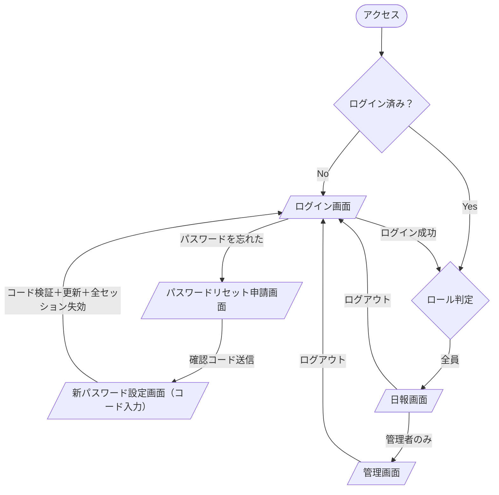

# 画面一覧・画面遷移図

## 画面一覧

| # | 画面名 | パス | 対象ユーザー |
|---|--------|------|-------------|
| 1 | ログイン画面 | `/login` | 全員 |
| 2 | パスワードリセット申請画面 | `/forgot-password` | 全員 |
| 3 | 新パスワード設定画面 | `/reset-password` | 全員（メールリンクからの遷移） |
| 4 | 認証コールバック画面 | `/confirm` | 全員（メールリンクからの遷移） |
| 5 | 日報画面 | `/report` | 全員（ログイン後） |
| 6 | 管理画面 | `/admin` | 管理者 |
| - | エラー画面 | （自動） | 全員（404/500時） |

---

## ロール別アクセス可能画面

| 画面 | 新人 | メンター | OJT | 管理者 |
|------|:----:|:--------:|:---:|:------:|
| ログイン画面 | ○ | ○ | ○ | ○ |
| パスワードリセット申請画面 | ○ | ○ | ○ | ○ |
| 新パスワード設定画面 | ○ | ○ | ○ | ○ |
| 認証コールバック画面 | ○ | ○ | ○ | ○ |
| 日報画面 | ○ | ○ | ○ | ○ |
| 管理画面 | × | × | × | ○ |

> 未ログイン状態でアクセスした場合は、すべてのページからログイン画面へリダイレクトする。
> ログイン後は全員 `/report`（日報画面）へ遷移する。管理者のみナビに管理画面リンクが表示される。

---

## 画面遷移図

---

## 各画面の主要コンポーネント

### 1. ログイン画面 `/login`
- メールアドレス入力フィールド
- パスワード入力フィールド
- ログインボタン
- パスワードリセットリンク

### 2. パスワードリセット申請画面 `/forgot-password`
- メールアドレス入力フィールド
- 確認コード送信ボタン（6桁の認証コード(OTP)をメール送信。リンクは使わない）
- **未登録メールはエラー表示**（コード画面へ進まない）。登録済みのときだけ `/reset-password` へ遷移
- ログイン画面へ戻るリンク

### 3. 新パスワード設定画面 `/reset-password`
- 送信先メールアドレス（申請画面から引き継ぎ・**編集不可**。変更は申請画面で）
- 確認コード入力フィールド（6桁）
- 新しいパスワード入力フィールド（8文字以上）＋確認用
- パスワード更新ボタン
- サーバーで `verifyOtp`（type=recovery）→ `updateUser` を実行。redirect は使わない
- 更新後はセキュリティのため全セッションを失効し、`/login` で再ログインを促す
- コードを再送するリンク（申請画面へ）

### 4. 日報画面 `/report`
- 担当新人セレクター（メンター・OJT・管理者のみ表示）
- 週ナビゲーション（前週・今週・次週）
- 週ジャンプ（日付ピッカーで任意の週に直接移動）
- 週間日報リスト（月〜金、曜日付き）
- 週次コメントエリア
- 日報入力・編集モーダル（新人のみ操作可）
- 日報行（報告がある日はクリックでインライン展開して詳細を表示）
- 週次コメント入力モーダル（メンター・OJTのみ）
- 担当新人が0件のメンター・OJTには「管理者にお問い合わせください」の空状態を表示

### 5. 管理画面 `/admin`
- タブ切替UI
  - **ユーザー管理**: ユーザー一覧・追加・役割変更・無効化
  - **メンター割り当て**: 新人ごとにメンター・OJTを割り当て
