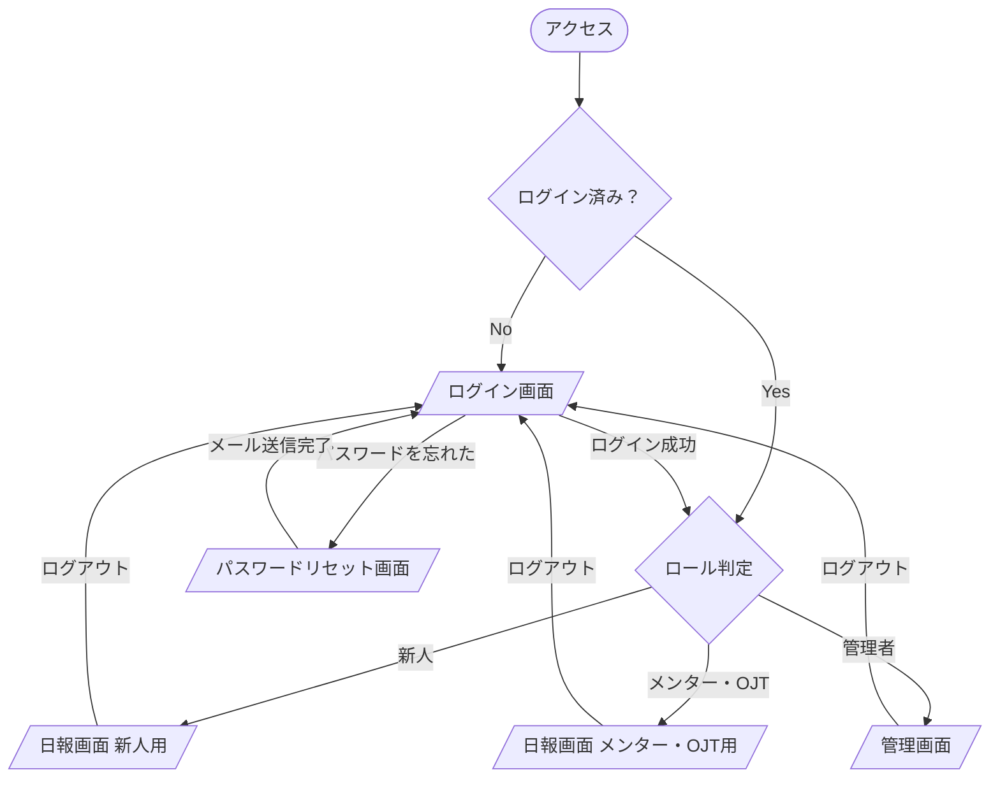

# 画面一覧・画面遷移図

## 画面一覧

| # | 画面名 | パス | 対象ユーザー |
|---|--------|------|-------------|
| 1 | ログイン画面 | `/login` | 全員 |
| 2 | パスワードリセット画面 | `/reset-password` | 全員 |
| 3 | 日報画面（新人用） | `/daily-report` | 新人 |
| 4 | 日報画面（メンター・OJT用） | `/mentor-dashboard` | メンター・OJT |
| 5 | 管理画面 | `/admin` | 管理者 |

---

## ロール別アクセス可能画面

| 画面 | 新人 | メンター | OJT | 管理者 |
|------|:----:|:--------:|:---:|:------:|
| ログイン画面 | ○ | ○ | ○ | ○ |
| パスワードリセット画面 | ○ | ○ | ○ | ○ |
| 日報画面（新人用） | ○ | × | × | × |
| 日報画面（メンター・OJT用） | × | ○ | ○ | × |
| 管理画面 | × | × | × | ○ |

> 未ログイン状態でアクセスした場合は、すべてのページからログイン画面へリダイレクトする。
> ログイン後は、ロールに応じた画面へ自動リダイレクトする。

---

## 画面遷移図

---

## 各画面の主要コンポーネント

### 1. ログイン画面 `/login`
- メールアドレス入力フィールド
- パスワード入力フィールド
- ログインボタン
- パスワードリセットリンク

### 2. パスワードリセット画面 `/reset-password`
- メールアドレス入力フィールド
- リセットメール送信ボタン
- ログイン画面へ戻るリンク

### 3. 日報画面（新人用）`/daily-report`
- 日報入力フォーム（日付・出勤時間・退勤時間・やったこと）
- 送信ボタン
- 自分の日報一覧（日付降順）
- 日報クリックで編集モードに切り替え

### 4. 日報画面（メンター・OJT用）`/mentor-dashboard`
- 担当新人の切り替えUI（複数担当の場合）
- 担当新人の日報一覧（日付降順）
- 日報詳細表示エリア
- 週次コメント入力フォーム
- 過去のコメント一覧

### 5. 管理画面 `/admin`
- タブ切替UI
  - **ユーザー管理**: ユーザー一覧・追加・役割変更・無効化
  - **メンター割り当て**: 新人ごとにメンター・OJTを割り当て
  - **全日報一覧**: 全新人の日報をフィルタ・検索して閲覧
